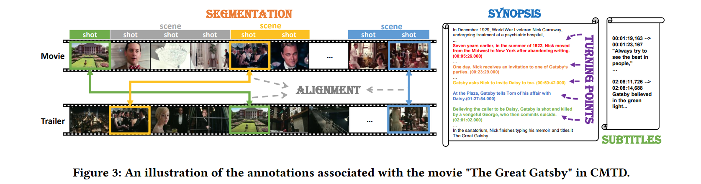
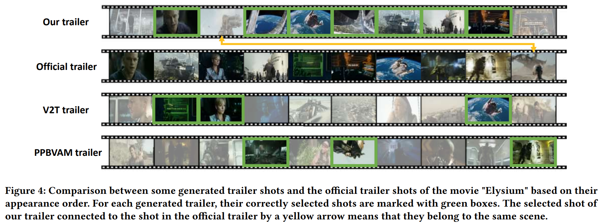
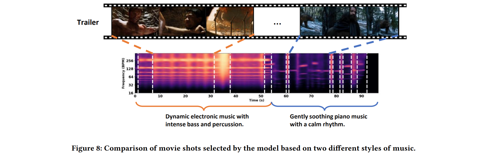

# [ACMMM 2024] An Inverse Partial Optimal Transport Framework for Music-guided Movie Trailer Generation

<div style="display: flex; justify-content: center; align-items: center;">
  <a href="http://arxiv.org/abs/2407.19456" style="margin: 0 2px;">
    
  </a>
  <a href="https://github.com/Dixin-Lab/Automatic-Movie-Trailer-Generator" style="margin: 0 2px;">
    
  </a>
  <a href='https://hhhh1138.github.io/project-page-trailer-generator/' style="margin: 0 2px;">
    
  </a>
<!--   <a href="https://github.com/Zheng-Chong/CatVTON/LICENCE" style="margin: 0 2px;">
    
  </a> -->
</div>


## ⏳ Project Struture
```
.
├── dataset
│   ├── CMTD
|   |   ├── training dataset
|   |   |   ├── audio_shot_embs (npy format, segmented audio shots)
|   |   |   ├── movie_shot_embs (npy format, segmented movie shots)
|   |   |   ├── trailer_shot_embs (npy format, segmented trailer shots)
|   |   |   └── audio_movie_alignments (json format, alignment relation of audio and movie shot indices)
|   |   ├── test dataset
|   |   |    ├── audio_shot_embs (npy format, segmented audio shots)
|   |   |    ├── movie_shot_embs (npy format, segmented movie shots)
|   |   |    ├── scene_test_movies (json format, test movie shot duration information)
|   |   |    └── ruptures_audio_segmentation.json (json format, test audio shot duration information)
|   |   ├── network_500.net
|   |   ├── metadata.json
|   |   └── tp_annotation.json
│   └── MV
|       ├── audio_shot_embs (npy format, segmented music shots)
|       └── movie_shot_embs (npy format, segmented video shots)
├── alignment
├── feature_extratction
├── segmentation
└── utils
```
## ⚙️ Main Dependencies
- python=3.8.19
- pytorch=2.3.0+cu121
- numpy=1.24.1
- matplotlib=3.7.5
- scikit-learn=1.3.2
- scipy=1.10.1
- sk-video=1.1.10
- ffmpeg=1.4

Or create the environment by:
```commandline 
pip install -r requirement.txt
```

## 🎥 Dataset 

###  Dataset structure
We construct a new public comprehensive movie-trailer dataset (CMTD) for movie trailer generation and future video understanding tasks. We train and evaluate various trailer generators on this dataset. Please download the CMTD dataset from these links: [CMTD](https://drive.google.com/drive/folders/1qYKi9nsrHUiOZIAvA-uTFOsOj0rEAc26?usp=drive_link). We also provide a music video dataset (MV) for pre-training process. Please download the MV dataset from these links: [MV](https://drive.google.com/drive/folders/1FROsoTIi4lhgSHfLFJ4phE7ZFxj3udcP?usp=drive_link), MV videos are a subset of [SymMV dataset](https://github.com/zhuole1025/SymMV).

It is worth noting that due to movie copyright issues, we cannot provide the original movies. The dataset only provides the visual and acoustic features extracted by ImageBind after we segmented the movie shot and audio shot using BaSSL.

### Model ckpt
We provide the trained model ```network_500.net``` under the CMTD dataset folder.

### Movie Shot Segmentation 
We use [BaSSL](https://github.com/kakaobrain/bassl) to split each movie into movie shots and scenes, the codes can be found in ```./segmentation/scene_segmentation_bassl.py```. 
If you want to perform shot segmentation on your local video, please be aware of modifying the path for reading the video and the path for saving the segmentation results in the code.

```commandline
movie_dataset_base = '' # video data directory
movies = os.listdir(movie_dataset_base)

save_scene_dir_base = '' # save directory of scene json files 
finished_files = os.listdir(save_scene_dir_base)
```

### Segment audio based on movie shots
During the training phase, in order to obtain aligned movie shots and audio shots from each official trailer, we segment the official trailer audio according to the duration of the movie shots.
The codes can be found in ```./segmentation/seg_audio_based_on_shots.py```. 
If you want to perform audio segmentation based on your movies shot segmentation, please be aware of modifying the path for reading the audio and the path for saving the segmentation results in the code.

```commandline
seg_json = dict()  # save the segmentation info of audio 
base = ''
save_seg_json_name = 'xxx.json'
save_bar_base = ""
scene_trailer_base = ""
audio_base = ""
```

### Music Shot Segmentation 
We use [Ruptures](https://github.com/deepcharles/ruptures) to split music into movie shots and scenes, the codes can be found in ```./segmentation/scene_segmentation_ruptures.py```. 
If you want to perform shot segmentation on your local audio, please be aware of modifying the path for reading the audio and the path for saving the segmentation results in the code.

```commandline
audio_file_path = ''  # music data path
save_result_base = ''  # save segmentation result
```
During testing phase, given a movie and a piece of music, we use BaSSL to segment the movie shots and Ruptures to segment the music shots.


### Feature Extraction
We use [ImageBind](https://github.com/facebookresearch/ImageBind) to extract visual features of movie shots and acoustic features of audio shots, the codes can be found in ```./feature_extraction/```. 


## 🏃‍♂️ Training
After downloading and placing the dataset correctly, you can use the codes to train the model: 
```
python train.py
```

## 🎬 Trailer Generation
After processing your own movies or downloading and placing data in test dataset correctly, you can use and modify the codes to generate the trailer: 
```
python trailer_generator.py
```




**More results can be found in the [project page](https://hhhh1138.github.io/project-page-trailer-generator/) !**

## 📖Citation
Please cite our paper if you use this code or CMTD and MV dataset:
```

```
